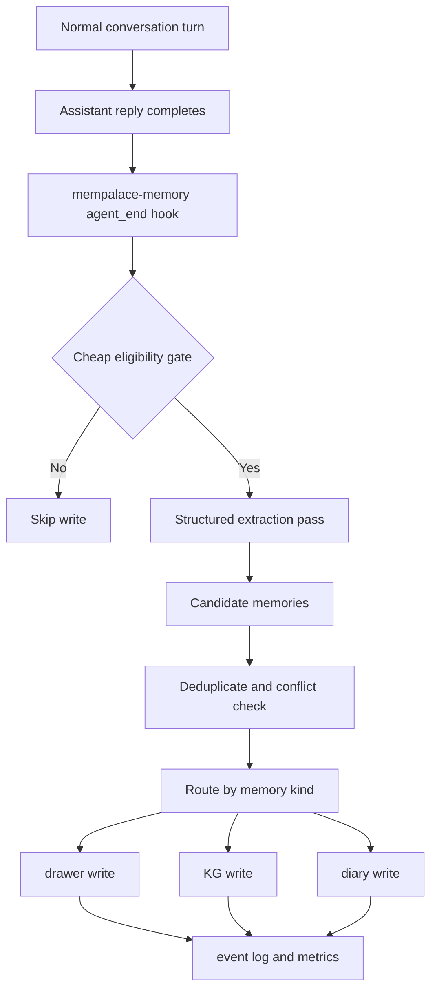

# plan: Automatic memory extraction for MemPalace backed sessions

## Overview

This plan adds an automatic memory extraction pipeline on top of the active
`mempalace-memory` path so OpenClaw can turn multi-turn conversations into
durable memory without requiring the agent to explicitly call memory tools in
normal dialogue.

The goal is not to save every conversation verbatim. The goal is to extract
high-value user facts, stable preferences, durable decisions, and continuity
notes with low token overhead and low memory pollution.

The implementation should extend the existing active-memory architecture rather
than introduce a separate "memory butler" agent or a frontend-only recorder.

## Problem Frame

The current memory system already has two automatic continuity paths:

- pre-compaction memory flush, which writes durable context before compaction
- session-memory hook, which writes a session summary on `/new` and `/reset`

Those paths reduce context loss, but they do not provide per-turn durable memory
extraction during ordinary conversation. As a result:

- important user facts can remain only in the live transcript until compaction
  or reset
- the agent may "know" something during the current session but fail to recall
  it in later sessions
- users experience the memory system as passive because memory writes are still
  mostly triggered by explicit tool use or lifecycle events

You want Jarvis style interaction where the system can automatically identify
important content from normal conversation and add it to memory, without
materially increasing token cost or flooding MemPalace with low-signal notes.

## Goals

- G1. Automatically extract high-value memory from normal conversations.
- G2. Keep MemPalace as the single primary user-facing memory substrate.
- G3. Reuse existing OpenClaw plugin and hook surfaces.
- G4. Keep the default behavior conservative and cheap.
- G5. Separate user memory from agent-private continuity memory.
- G6. Use MemPalace-native storage types intentionally:
  - drawers for evidence
  - knowledge graph for durable facts and relationships
  - diary for short continuity notes
- G7. Support gradual rollout, observability, and safe fallback.

## Non-Goals

- Do not save every message or every long reply automatically.
- Do not build a browser-only or channel-specific solution.
- Do not introduce a second always-on orchestration agent just for memory.
- Do not bypass the existing `mempalace-memory` plugin and write directly from
  scattered call sites.
- Do not promote uncertain conversational content directly into the knowledge
  graph by default.

## Current State

### Existing Durable-Memory Paths

- [docs/concepts/memory.md](/Users/qiguang/openclaw/docs/concepts/memory.md:1)
  documents MemPalace as the practical primary memory path in this deployment.
- [src/auto-reply/reply/agent-runner.ts](/Users/qiguang/openclaw/src/auto-reply/reply/agent-runner.ts:310)
  runs `runMemoryFlushIfNeeded(...)` before the main reply pipeline.
- [extensions/mempalace-memory/src/flush-plan.ts](/Users/qiguang/openclaw/extensions/mempalace-memory/src/flush-plan.ts:1)
  already defines a MemPalace-specific memory flush policy and allowed tool set.
- [src/hooks/bundled/session-memory/handler.ts](/Users/qiguang/openclaw/src/hooks/bundled/session-memory/handler.ts:57)
  writes reset/new summaries to MemPalace first, then falls back to workspace
  files only if needed.
- [extensions/mempalace-memory/src/tools.ts](/Users/qiguang/openclaw/extensions/mempalace-memory/src/tools.ts:1229)
  provides durable write APIs plus duplicate-aware `memory_write`.

### Existing Lifecycle Surfaces Suitable for Auto Extraction

- [src/agents/pi-embedded-runner/run/attempt.ts](/Users/qiguang/openclaw/src/agents/pi-embedded-runner/run/attempt.ts:2119)
  fires `agent_end` asynchronously after a run completes.
- [src/agents/pi-embedded-runner/run/attempt.ts](/Users/qiguang/openclaw/src/agents/pi-embedded-runner/run/attempt.ts:2231)
  fires `llm_output` asynchronously with the assistant texts and usage.
- [docs/concepts/agent-loop.md](/Users/qiguang/openclaw/docs/concepts/agent-loop.md:70)
  documents the plugin lifecycle hooks that can observe reply completion.

These surfaces are a better fit than a separate listener agent because they:

- already sit in the correct turn lifecycle
- can run fire-and-forget without delaying the user reply
- preserve access to agent/session/workspace metadata
- keep responsibility inside the active memory plugin

## Decision Summary

Implement automatic memory extraction as a feature of the `mempalace-memory`
plugin, using an asynchronous post-reply lifecycle hook as the primary trigger.

The recommended trigger order is:

1. `agent_end` as the primary extraction entrypoint
2. existing pre-compaction memory flush as a safety net
3. existing `session-memory` hook on `/new` and `/reset` as session archival

This keeps normal conversation extraction cheap, preserves the current safety
paths, and avoids architectural duplication.

## Why Not the Other Proposed Approaches

### Separate Memory Butler Agent

Reject as the primary design.

Reason:

- adds extra orchestration, token spend, and failure modes
- duplicates lifecycle visibility the plugin system already provides
- creates consistency questions around shared/private memory routing
- is harder to reason about than a plugin-local feature

### Browser Extension or User Script

Reject as the primary design.

Reason:

- only covers web surfaces
- OpenClaw sessions span CLI, chat channels, hooks, and background runs
- stores memory logic in the wrong layer

### Save Based Only on Message Length or Keywords

Reject as the primary design.

Reason:

- high false positive rate
- encourages noisy drawer growth
- does not separate user preference, evidence, and continuity semantics

### Save Entire Conversation Every N Messages

Reject as the default.

Reason:

- predictable but low precision
- expensive relative to value
- produces poor retrieval quality over time

## Proposed Architecture



## Trigger Strategy

### Primary Trigger

Register an `agent_end` plugin hook from `mempalace-memory`.

Why `agent_end`:

- it sees the completed conversation snapshot
- it runs asynchronously and does not block the reply
- it includes success/failure metadata
- it can read the transcript on disk if needed

### Secondary Trigger

Retain the current pre-compaction memory flush.

Why:

- it remains the best last-chance durability pass before compaction
- it catches cases where normal-turn extraction was skipped
- it already has explicit MemPalace tool guidance

### Archival Trigger

Retain the current `session-memory` hook for `/new` and `/reset`.

Why:

- it is useful for coarse session archiving
- it complements, rather than replaces, per-turn extraction

## Extraction Pipeline

### Stage 1: Cheap Eligibility Gate

Run a low-cost filter before any extraction pass.

Candidate gates:

- ignore failed runs
- ignore turns with no assistant text
- ignore extremely short exchanges
- ignore command-only noise
- ignore turns already covered by recent identical content hashes
- ignore turns inside a cooldown window for the same session unless they
  contain strong memory signals

Input signals:

- assistant text length
- user text length
- presence of "rememberable" intents such as preference, goal, constraint,
  personal fact, decision, recap, or plan
- presence of structured decision language
- recent extraction state for the same session

This stage should be deterministic and cheap.

### Stage 2: Structured Extraction Pass

When the cheap gate passes, run a focused extraction pass that returns a small,
typed candidate set.

The extractor should classify candidates into:

- `user_fact`
- `user_preference`
- `user_goal`
- `decision`
- `constraint`
- `project_continuity`
- `ephemeral_continuity`

Each candidate should include:

- normalized text
- type
- confidence
- evidence snippet
- whether it is user-shared or agent-private
- preferred storage target: `drawer`, `kg`, or `diary`

### Stage 3: Deduplication and Conflict Check

Before writing:

- query existing similar drawer content
- check for existing KG facts when the candidate targets KG
- suppress near-duplicates
- downgrade uncertain KG candidates to drawer evidence
- optionally invalidate superseded KG facts only when the new fact is explicit
  and high confidence

This should reuse existing MemPalace tooling and patterns where possible.

### Stage 4: Storage Routing

#### Drawer

Use drawer for:

- verbatim evidence
- user statements that may matter later
- decisions that should retain the original wording
- uncertain but important facts

#### Knowledge Graph

Use KG for:

- stable preferences
- durable identity facts
- long-lived relationships
- explicit decisions with clear subject-predicate-object structure

Default rule:

Write to KG only when confidence is high and the statement is durable enough to
survive future contradiction.

#### Diary

Use diary for:

- short-lived continuity hints
- agent working context that helps near-term flow
- non-user-facing agent reflections that should not pollute long-term recall

Diary should not become the default sink for everything. It is a continuity
surface, not a dumping ground.

## Shared vs Private Memory Routing

Use the existing `mempalace-memory` config model for shared/private palace
routing.

### Shared Memory

Write to shared memory when the candidate is about the user and should help
multiple agents:

- user preferences
- long-term goals
- stable personal or project facts
- cross-agent constraints and standing instructions

### Private Memory

Write to private memory when the candidate is mostly local to one agent:

- agent-local continuity
- execution-specific reasoning notes
- temporary task state
- localized project trail that should not be globalized

### Rule of Thumb

If the memory answers "what should all Jarvis-like agents know about this
user?", route shared.

If it answers "what should this agent remember to continue its own work?",
route private.

## Configuration Surface

Add a conservative config section under `plugins.entries.mempalace-memory.config`.

Suggested keys:

```json5
{
  plugins: {
    entries: {
      "mempalace-memory": {
        enabled: true,
        config: {
          autoExtract: {
            enabled: true,
            mode: "conservative",
            minConfidence: 0.8,
            cooldownTurns: 4,
            maxWritesPerTurn: 2,
            writeSharedUserMemory: true,
            writePrivateContinuity: true,
            allowDirectKgWrites: false,
            categories: ["user_preference", "user_goal", "decision", "constraint"],
          },
        },
      },
    },
  },
}
```

Recommended default modes:

- `off`
- `conservative`
- `balanced`

`conservative` should be the initial default for production.

## Rollout Plan

### Phase 1: Conservative Drawer First MVP

Deliver:

- `agent_end` hook registration inside `mempalace-memory`
- cheap eligibility gate
- extraction for a narrow set of memory categories
- drawer writes only
- dedupe against existing drawers
- structured event logging

Success criteria:

- low false positive rate
- no visible user latency increase
- no uncontrolled drawer growth

### Phase 2: Shared and Private Routing

Deliver:

- explicit shared/private routing rules
- per-candidate target scope
- config knobs for user-memory sharing

Success criteria:

- user profile facts become cross-agent recallable
- agent-private continuity remains isolated

### Phase 3: Controlled KG Promotion

Deliver:

- direct KG writes for high-confidence facts
- conflict handling and invalidation strategy
- policy to downgrade uncertain facts to drawer evidence

Success criteria:

- stable facts become easier to recall semantically
- KG pollution stays low

### Phase 4: Dreaming Integration

Deliver:

- auto-extraction outputs feed later dreaming passes
- repeated drawer recall can justify KG promotion
- diary remains concise and continuity-oriented

Success criteria:

- long-term memory quality improves over time
- durable facts are promoted through evidence, not guesswork

## Recommended Implementation Shape

### New Components

Inside `extensions/mempalace-memory/src/`, add a small cluster such as:

- `auto-extract.ts`
- `auto-extract-config.ts`
- `auto-extract-types.ts`
- `auto-extract-hook.ts`

Responsibilities:

- config resolution
- cheap gate logic
- extraction orchestration
- routing and write decisions
- logging and metrics

### Integration Points

- register the hook in
  [extensions/mempalace-memory/index.ts](/Users/qiguang/openclaw/extensions/mempalace-memory/index.ts:1)
- reuse config resolution patterns from
  [extensions/mempalace-memory/src/config.ts](/Users/qiguang/openclaw/extensions/mempalace-memory/src/config.ts:1)
- reuse duplicate and write paths from
  [extensions/mempalace-memory/src/tools.ts](/Users/qiguang/openclaw/extensions/mempalace-memory/src/tools.ts:1229)
- keep the current memory flush path unchanged initially

## Prompting Strategy

The extraction pass should be tightly bounded. It should not ask the model to
"summarize the conversation". It should ask for a very small set of durable
memory candidates only.

Good extraction prompt qualities:

- asks for durable future-useful information only
- distinguishes user facts from agent continuity
- allows "no memory worth saving"
- requires typed outputs
- penalizes guesses and one-off chatter

Avoid:

- freeform summaries
- broad recap generation
- category explosion
- direct KG generation from ambiguous text

## Observability

Log enough to debug quality without exposing unnecessary private content.

Recommended telemetry:

- extraction attempted or skipped
- skip reason
- number of candidates returned
- number of writes performed
- drawer vs KG vs diary counts
- shared vs private counts
- dedupe suppressions
- elapsed extraction time

If possible, emit explicit memory events similar to existing memory host events
so later dreaming and diagnostics can inspect the pipeline.

## Risks

### R1. Memory Pollution

If the extractor is too eager, retrieval quality will degrade over time.

Mitigation:

- conservative default mode
- low write cap per turn
- drawer-first rollout
- strong dedupe and cooldown logic

### R2. Token Cost Drift

A per-turn extraction pass can quietly increase overall cost.

Mitigation:

- cheap eligibility gate first
- narrow extraction prompt
- async execution
- rollout metrics

### R3. Incorrect KG Facts

Direct KG writes from ambiguous chat can create hard-to-detect false memory.

Mitigation:

- drawer first
- direct KG writes only for high-confidence explicit facts
- later promotion via dreaming and repeated evidence

### R4. Cross-Agent Leakage

Shared memory can leak local execution notes into user-global memory.

Mitigation:

- clear shared/private routing rules
- default private for continuity notes
- shared writes only for user-level durable facts

### R5. Hidden Latency or Failure Coupling

If extraction is synchronous, users could feel reply latency or failures could
affect normal turns.

Mitigation:

- run from asynchronous post-reply hooks
- treat extraction failures as non-fatal

## Test Plan

### Unit Tests

- cheap eligibility gate
- shared/private routing
- dedupe suppression
- drawer/KG/diary routing rules
- cooldown behavior
- config resolution

### Integration Tests

- successful `agent_end` extraction writes drawer entries
- skip on low-signal turn
- no user-visible reply delay from hook execution
- extraction failures do not fail the main turn
- shared-user memory lands in the intended palace path
- private continuity lands in the per-agent palace path

### Regression Tests

- existing memory flush behavior remains unchanged
- existing session-memory hook remains unchanged
- existing `memory_search` and `memory_get` continue to work on newly written
  entries

### Manual Verification

- chat a few realistic Jarvis-like preference and goal statements
- confirm only the durable statements persist
- confirm repeated similar turns do not duplicate memory
- confirm later recall can surface the saved memory

## Suggested Acceptance Criteria

- AC1. A normal conversation turn can automatically produce durable memory
  without explicit memory tool use.
- AC2. The feature does not materially delay user-visible replies.
- AC3. Conservative mode writes at most a small bounded number of memories per
  eligible turn.
- AC4. Shared user facts and private continuity notes are routed separately.
- AC5. Memory duplication stays low under repeated similar turns.
- AC6. Existing memory flush and session-memory flows continue to operate.
- AC7. The feature can be disabled cleanly by config.

## Recommended Next Implementation Order

1. Add config schema and resolver for `autoExtract`.
2. Add `agent_end` hook registration in `mempalace-memory`.
3. Implement the cheap eligibility gate.
4. Implement drawer-only extraction MVP.
5. Add dedupe, cooldown, and logging.
6. Add shared/private routing.
7. Add optional direct KG writes behind a stricter config gate.
8. Add tests and rollout docs.

## Final Recommendation

The most reasonable path is to build automatic memory extraction inside
`mempalace-memory` as an asynchronous post-reply feature, not as a second
memory system.

Use `agent_end` for normal-turn extraction, keep pre-compaction memory flush as
the safety net, keep `/new` and `/reset` session-memory as archival, and roll
out in a conservative drawer-first sequence before enabling broader KG writes.
